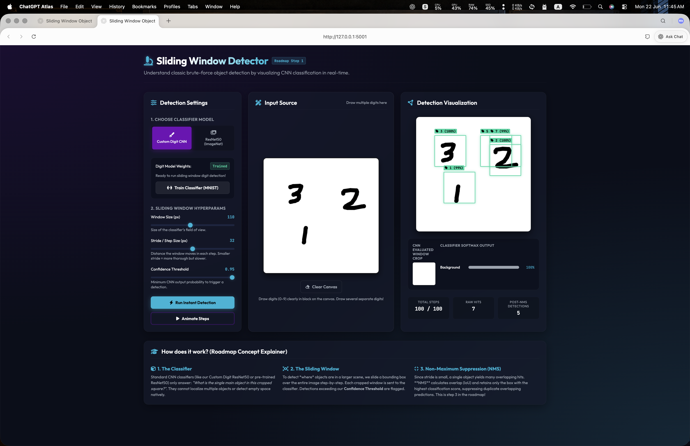
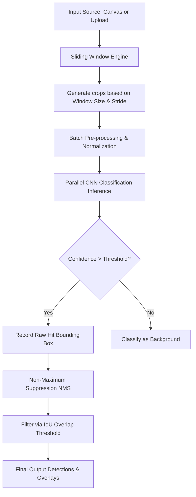

# Sliding Window Object Detector

[](https://www.python.org/)
[](https://pytorch.org/)
[](https://flask.palletsprojects.com/)
[](https://opencv.org/)

An interactive, real-time web-based learning dashboard designed to demonstrate the inner workings of **classic sliding window object detection**, **classifier evaluation**, and **Non-Maximum Suppression (NMS)**. 

This repository serves as **Step 1** of the comprehensive [Object Detection Learning Roadmap](../object_detection_roadmap.md), taking you from brute-force search up to state-of-the-art transformer-based detectors.

---

## Interface Preview


*The modern glassmorphism dashboard running custom MNIST digit classification and live ResNet50 object detection.*

---

## Features

* **Interactive Drawing Canvas**: Draw handwritten digits (0-9) dynamically on a custom HTML5 canvas to test digit detection.
* **Image Upload & Samples**: Upload local PNG/JPG images or try out interactive styled sample objects (Coffee Mug, Mechanical Keyboard, Gaming Mouse) to test real-world ImageNet classification.
* **Custom CNN Training**: Train a PyTorch ResNet50 classifier model directly in the app. The training process runs in a background thread and updates a live progress bar showing loss and validation accuracy in real-time.
* **Interactive Step-by-Step Animation**: Watch the sliding window traverse the image in real-time. Visualize the crops being evaluated, review the classifier's live softmax confidence outputs, and see raw hits form a spatial heatmap overlay.
* **Adjustable Hyperparameters**:
  * **Window Size**: Change the classifier's field of view in pixels.
  * **Stride**: Adjust the step size of the window. See firsthand how smaller strides yield thorough results but increase computational complexity, while larger strides run faster but miss smaller details.
  * **Confidence Threshold**: Fine-tune the minimum classification confidence required to trigger a bounding box hit.
* **Non-Maximum Suppression (NMS)**: Watch how hundreds of overlapping raw hits are filtered down to precise, single bounding boxes based on Intersection over Union (IoU) overlap thresholds.

---

## How It Works (The Math & Theory)

Classical sliding window detection converts a **classification model** into a **detection model** by scanning an image across space and scale.



### 1. Sliding Window Search Space
The number of windows $N_{\text{windows}}$ generated for an image of dimensions $W \times H$, with a window size of $W_{\text{win}} \times H_{\text{win}}$ and step size (stride) $S$, is defined as:

$$N_{\text{windows}} = \left( \lfloor \frac{W - W_{\text{win}}}{S} \rfloor + 1 \right) \times \left( \lfloor \frac{H - H_{\text{win}}}{S} \rfloor + 1 \right)$$

* **The Stride Dilemma**: If $S = 4$ on a $400 \times 400$ image with $80 \times 80$ windows, the model must classify **6,561 crops**. If $S = 16$, the crops decrease to **441**. This demonstrates why classical detectors are highly CPU/GPU intensive and why region proposal networks (like R-CNN) were developed.

### 2. Batched Parallel Inference
Instead of passing crops to PyTorch sequentially (which incurs heavy Python-to-C++ context-switching overhead), crops are stacked into a single tensor batch:
$$\mathbf{X}_{\text{batch}} \in \mathbb{R}^{K \times C \times H_{\text{win}} \times W_{\text{win}}}$$
and evaluated in parallel. The backend automatically targets hardware accelerators:
* **Apple Silicon**: Metal Performance Shaders (`mps`)
* **NVIDIA GPUs**: CUDA (`cuda`)
* **Standard CPUs**: Multi-threaded execution (`cpu`)

### 3. Non-Maximum Suppression (NMS)
Because window strides are small, adjacent windows covering the same object will all report high classification scores. NMS resolves this redundancy:
1. Sort all raw detection boxes by confidence score $s_i$ in descending order.
2. Select the box with the highest score, save it as a final detection, and remove it from the candidate list.
3. Compute the **Intersection over Union (IoU)** between this box $B_{\text{best}}$ and all other remaining candidate boxes $B_j$:

$$\text{IoU}(B_{\text{best}}, B_j) = \frac{\text{Area}(B_{\text{best}} \cap B_j)}{\text{Area}(B_{\text{best}} \cup B_j)}$

4. Suppress (discard) any box $B_j$ where $\text{IoU}(B_{\text{best}}, B_j) \geq \text{Threshold}_{\text{IoU}}$ (typically $0.3$).
5. Repeat until no candidate boxes remain.

---

## Architecture & Project Structure

The project has been architected to keep code modular, readable, and highly optimized:

```bash
1-Sliding-Window-Detector/
├── app.py                  # Flask Web Server, API endpoints, background trainer coordinator
├── detector.py             # Sliding window grid builder, batched CNN inference loops, NMS, IoU functions
├── model.py                # MNIST ResNet50 classifier definition & training pipeline logic
├── run.sh                  # Interactive startup script (Conda check, dependency verification, run)
├── training_status.json    # Shared status file for monitoring training progress across threads
├── templates/
│   └── index.html          # Web UI layout (dashboard panels, controls, explainer text)
└── static/
    ├── style.css           # Premium glassmorphism design system & responsive styling
    └── main.js             # HTML5 canvas drawing, AJAX API wrappers, live step animation loop
```

### Key Components
* **`model.py` (Custom Classifier)**: Uses a modified `ResNet50` backbone. The first convolution layer is altered to accept 1-channel grayscale input (instead of 3-channel RGB), and the final fully connected layer is replaced to output 10 classes (digits 0-9).
* **`detector.py` (Inference Optimizer)**: Preprocesses crops by resizing, converting formats, and normalizing. Implements a customized fast, vector-based per-class NMS algorithm.
* **`app.py` (Concurreny Coordinator)**: Runs training on a background daemon thread, writing atomic updates to `training_status.json` so the Flask frontend can poll progress asynchronously without blocking client requests.

---

## Setup & Installation

The project includes an automated startup script `run.sh` that checks for your Python environment and installs any missing packages.

### Prerequisites
1. Install [Miniconda / Anaconda](https://docs.conda.io/en/latest/miniconda.html).
2. Open terminal and navigate to the project directory:
   ```bash
   cd 1-Sliding-Window-Detector
   ```
3. Create a Conda environment for the project:
   ```bash
   conda create -n sliding_window_env python=3.9 -y
   ```

### Quickstart
Simply run the startup script:
```bash
chmod +x run.sh
./run.sh
```

The script will automatically:
1. Verify the conda environment exists.
2. Verify all python dependencies (`flask`, `torch`, `torchvision`, `opencv-python`, `numpy`, `pillow`) are present (and prompt installation if missing).
3. Start the Flask server on `http://127.0.0.1:5001`.

Open `http://127.0.0.1:5001` in your browser to begin exploring!

---

## Learning Exercises to Try

1. **Test Spatial Stride**: Select **Digit CNN**, draw a single number on the canvas, set the stride to `4`, and click **Animate Steps**. Notice how long the scan takes and how dense the raw hits are. Now set the stride to `30` and run again. Observe how much faster it finishes, and note if it fails to localize the digit correctly.
2. **Train the Digit Model**: Delete the existing weights (or hit the **Train Classifier** button). Watch the progress update in real-time as PyTorch downloads MNIST and starts training. Once training finishes (approx. 1-2 minutes on CPU/MPS), draw a combination of multiple digits (e.g. `3` and `7`) side-by-side and run detection.
3. **Verify NMS Influence**: Select **ResNet50**, choose the **Coffee Mug** sample, set the confidence to `0.50`, and run **Instant Detection**. Look at the stats at the bottom: compare **Raw Hits** to **Post-NMS Detections** to appreciate how NMS keeps the final visual clean.
