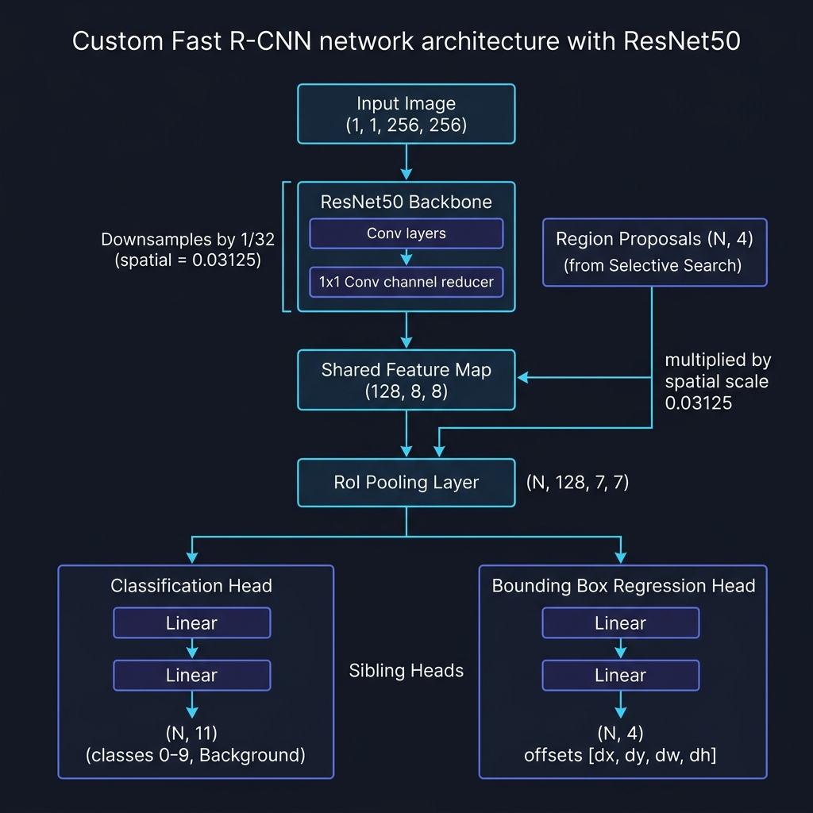
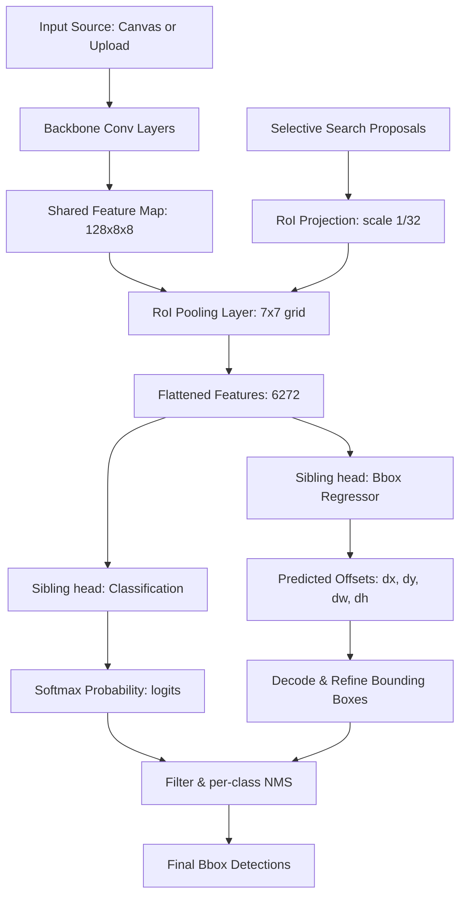

# Region Proposals & Fast R-CNN Object Detector (Step 2)

[](https://www.python.org/)
[](https://pytorch.org/)
[](https://flask.palletsprojects.com/)
[](https://opencv.org/)

An interactive, real-time web dashboard designed to demonstrate the inner workings of **Region Proposals**, **Once-per-image Feature Extraction**, **Region of Interest (RoI) Pooling**, and **Bounding Box Regression Refinement** (the core ideas behind Fast R-CNN).

This module serves as **Step 2** of the [Object Detection Learning Roadmap](../object_detection_roadmap.md), moving beyond brute-force sliding windows to unified feature map projections.

---

## Model Architecture

Below is the layout of the custom Digit Fast R-CNN detector model implemented in this module:



---

## Key Features

* **Selective Search Proposal Generator**: Generates candidate regions dynamically using MSER (Maximally Stable Extremal Regions) and multi-scale contours, reducing candidate counts from thousands of sliding windows to a few dozen structurally proposed regions.
* **Once-Per-Image Convolutional Backbone**: Runs the ConvNet backbone over the full image *exactly once* to construct a shared feature map, bypassing the massive redundancy of running crops through the network individually.
* **RoI Pooling Inspector**: Projects bounding box coordinates onto the feature map (scaled by 1/32 for both Digit and ImageNet models) and max-pools them into a fixed $7 \times 7$ grid. Interact with proposals on the screen to inspect their pooled feature activation grid in real time.
* **Bounding Box Regressor Sibling Head**: Computes coordinate offset predictions ($dx, dy, dw, dh$) to refine region proposals, mapping them precisely to target boundaries.
* **Kaggle GPU Training Integration**: Includes a self-contained notebook to run fast GPU training in Kaggle, saving weights directly to local checkpoints.
* **Performance Speedup Calculator**: Computes theoretical FLOPs complexity in real-time, showing the huge efficiency savings of Fast R-CNN vs. classic crop-based Sliding Window detectors.

---

## How It Works (The Math & Theory)



### 1. Bounding Box Regression Formulation
For a proposed bounding box center-coordinates $(x_p, y_p, w_p, h_p)$ and a matching ground-truth target $(x_t, y_t, w_t, h_t)$, the regression offsets $(t_x, t_y, t_w, t_h)$ are formulated as:

$$t_x = \frac{x_t - x_p}{w_p}, \quad t_y = \frac{y_t - y_p}{h_p}$$
$$t_w = \log\left(\frac{w_t}{w_p}\right), \quad t_h = \log\left(\frac{h_t}{h_p}\right)$$

The regressor sibling head is trained using Smooth L1 Loss (Huber Loss) to predict these offsets. During inference, predicted offsets $(d_x, d_y, d_w, d_h)$ are decoded to reconstruct the refined bounding box:

$$x_{\text{refined}} = x_p + w_p \cdot d_x, \quad y_{\text{refined}} = y_p + h_p \cdot d_y$$
$$w_{\text{refined}} = w_p \cdot \exp(d_x), \quad h_{\text{refined}} = h_p \cdot \exp(d_y)$$

### 2. Multi-Task Sibling Head Loss
We optimize the model end-to-end using a joint multi-task loss function:

$$L(p, t) = L_{\text{cls}}(p, u) + \lambda [u \ge 1] L_{\text{loc}}(t, v)$$

* $L_{\text{cls}}$ is Cross-Entropy loss over the classes ($u=10$ represents background).
* $L_{\text{loc}}$ is Smooth L1 loss. The Iverson bracket $[u \ge 1]$ ensures regression loss is ignored for background crops.

---

## Directory Index

```bash
2-Region-Proposals(Fast_R-CNN_Idea)/
├── app.py                      # Flask Web Server & API endpoints
├── fast_rcnn.py                # Inference pipeline (MSER and NMS operations)
├── model.py                    # Network structure & local training loops (ROIPool, FastRCNN)
├── run.sh                      # Checks dependencies & starts Flask on port 5004
├── train_fast_rcnn_kaggle.ipynb # Self-contained Jupyter notebook for fast Kaggle GPU training
├── checkpoints/                # Target folder for Kaggle-trained best_model.pth weights
│   └── best_model.pth
├── templates/
│   └── index.html              # Glassmorphism workspace UI
└── static/
    ├── style.css               # Custom glassmorphic stylesheets
    └── main.js                 # Canvas drawing, AJAX triggers, & RoI inspector grids
```

---

## Quickstart Setup & Training

### 1. Train the Detector Model on Kaggle
To achieve high accuracy and learn coordinate offsets, it is recommended to train the model on a GPU.
1. Upload the self-contained [train_fast_rcnn_kaggle.ipynb](train_fast_rcnn_kaggle.ipynb) notebook to Kaggle.
2. Select **GPU T4** (or another GPU) as the accelerator in your Kaggle Notebook Settings.
3. Enable **Internet Access** in settings (required to download standard MNIST dataset files).
4. Run all cells. The notebook will automatically download the dataset, generate synthetic multi-digit training images, perform Fast R-CNN training on GPU, evaluate, and save `best_model.pth` in `/kaggle/working/`.
5. Download the generated `best_model.pth` file from Kaggle.

### 2. Add Weights locally
Place the downloaded weight file in the checkpoints folder:
`2-Region-Proposals(Fast_R-CNN_Idea)/checkpoints/best_model.pth`

### 3. Launch the Application
Run the startup script:
```bash
chmod +x run.sh
./run.sh
```

Navigate to **`http://127.0.0.1:5003`** in your browser. Draw separate digits or upload standard ImageNet photos to test shared feature pooling!
