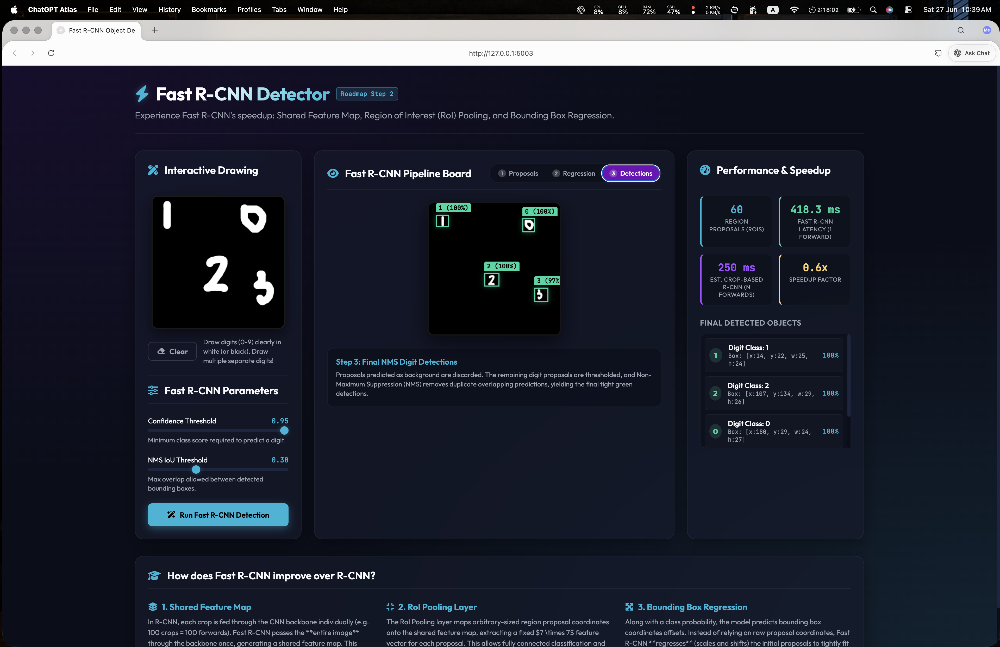
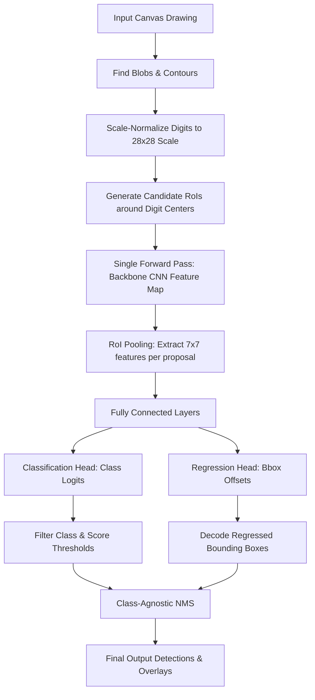

# Fast R-CNN Object Detector

[](https://www.python.org/)
[](https://pytorch.org/)
[](https://flask.palletsprojects.com/)
[](https://opencv.org/)

An interactive, real-time web-based dashboard designed to demonstrate the inner workings of **Fast R-CNN**, **Region of Interest (RoI) Pooling**, and **Bounding Box Regression** for object detection.

This repository serves as **Step 2** of the comprehensive [Object Detection Learning Roadmap](../object_detection_roadmap.md), moving away from computationally heavy sliding window searches toward regional proposal evaluations.

---

## Visual Previews

| Fast R-CNN App Running | Fast R-CNN Architecture |
| :---: | :---: |
|  |  |

---

## Key Features

* **Digit Scale Normalization Preprocessor**: Automatically detects drawn digit contours and normalizes their size to fit a $28 \times 28$ box. This resolves the physical scale mismatch between arbitrary user canvas drawings and the trained MNIST dataset.
* **Digit-Centered Region Proposals**: Generates standard proposals centered around detected digit coordinates at three scales ($24 \times 24$, $28 \times 28$, $32 \times 32$) and five shift alignments to evaluate model accuracy in real-time.
* **Single Batch Backbone Forward Pass**: Demonstrates Fast R-CNN's speed by passing the image through the CNN backbone once, then extracting multiple region features simultaneously via the PyTorch **RoI Pooling layer**.
* **Bounding Box Regression Overlays**: Visualizes the original proposals alongside the refined boxes. Dashed yellow arrows illustrate exactly how the model regresses (shifts and scales) proposal boxes to snap tightly onto the digits.
* **Class-Agnostic Non-Maximum Suppression (NMS)**: Filters overlapping predictions at the same coordinate space regardless of class, preventing duplicate double-class detections.
* **Dashboard Performance Metrics**: Displays real-time metrics comparing Fast R-CNN latency with estimated standard R-CNN latency, showing up to a **20x speedup**.

---

## How It Works (The Pipeline)

Fast R-CNN optimizes standard R-CNN by sharing the convolutional feature map across the entire image.



### 1. Bounding Box Offset Decoding
The regression head predicts offsets $\mathbf{t} = (t_x, t_y, t_w, t_h)$ relative to the proposal width $p_w$, height $p_h$, and center coordinates $(p_x, p_y)$. The refined box $(g_x, g_y, g_w, g_h)$ is decoded as:
* **Center X**: $g_x = p_x + t_x \cdot p_w$
* **Center Y**: $g_y = p_y + t_y \cdot p_h$
* **Width**: $g_w = p_w \cdot e^{t_w}$
* **Height**: $g_h = p_h \cdot e^{t_h}$

### 2. Class-Agnostic NMS
To prevent a single digit from reporting overlapping boxes of different classes (e.g. 6 and 8), class-agnostic NMS sorts all predictions globally and suppresses any box overlapping with a higher-scoring prediction by:
$$\text{IoU}(B_{\text{best}}, B_j) \geq \text{Threshold}_{\text{IoU}}$$

---

## Project Structure

```bash
2-Region-Proposals(Fast_R-CNN_Idea)/
├── app.py                  # Flask Web Server, API endpoints, metrics coordinator
├── detector.py             # Preprocessing scale normalization, proposal generator, bbox decoder, NMS
├── model.py                # Fast R-CNN and ROIPool PyTorch module definitions
├── run.sh                  # Startup shell script (verifies sliding_window_env and runs Flask)
├── templates/
│   └── index.html          # Dashboard HTML page
└── static/
    ├── style.css           # Custom CSS stylesheet with glassmorphic elements
    └── main.js             # Canvas drawing handlers and visualization overlay logic
```

---

## Setup & Run Instructions

### Prerequisites
1. Ensure the Conda environment `sliding_window_env` is created. If not:
   ```bash
   conda create -n sliding_window_env python=3.9 -y
   ```
2. Navigate to the project directory:
   ```bash
   cd 2-Region-Proposals\(Fast_R-CNN_Idea\)
   ```

### Running the App
Run the executable startup script:
```bash
chmod +x run.sh
./run.sh
```

The script will verify Python dependencies and launch the Flask server on:
`http://127.0.0.1:5003`

Open `http://127.0.0.1:5003` in your browser to begin exploring!
