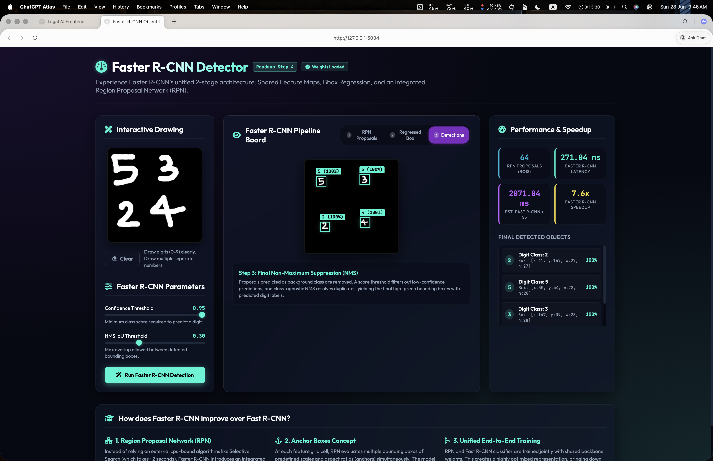
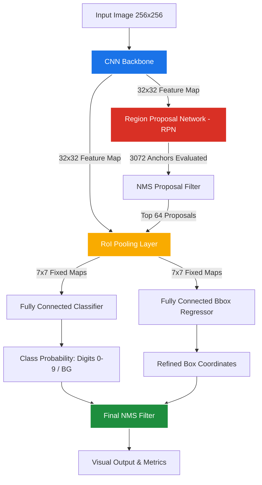

# Interactive Faster R-CNN Multi-Digit Object Detector

Welcome to the **Interactive Faster R-CNN Object Detector** web application! This project provides a hands-on, visual learning experience showcasing the unified 2-stage object detection architecture of **Faster R-CNN** implemented in PyTorch and served with a Flask backend.

Instead of treating object detection as a black box, this application lets you draw multiple hand-drawn digits (0-9) in real-time, inspect how candidate regions are proposed, see how bounding boxes are regressed, and visualize the performance speedup of a unified network over older 2-stage detectors (like Fast R-CNN).

---

## Web Application Interface

Below is the user interface of the running application, showing the interactive canvas, the pipeline board, and the real-time speedup analysis:



---

## Key Features

- **Interactive Multi-Digit Drawing**: Draw numbers on the 256x256 canvas. You can draw several digits at the same time at different positions.
- **Robust Digit Normalization & Centering**: A custom preprocessing pipeline extracts contours, rescales the drawn shapes to fit a standard MNIST-like 20x20 bounding box, and centers them in 28x28 cells on a 256x256 canvas. This ensures high detection accuracy by bridging the gap between hand-drawn scales and training data.
- **Unified 2-Stage Faster R-CNN Pipeline**:
  - **Shared Backbone Convolutional Features**: Generates feature maps shared by both the proposal and classification networks.
  - **Region Proposal Network (RPN)**: Dynamically evaluates 3,072 sliding anchor boxes to suggest region proposals (RoIs) in milliseconds, completely bypassing CPU-bound algorithms like Selective Search.
  - **RoI Pooling**: Crops and resizes varying feature proposals into fixed 7x7 maps.
  - **Classification & Box Regression Heads**: Categorizes proposals (digits 0-9 or background) and refines bounding box coordinates.
- **Visual Pipeline Explorer**:
  1. **RPN Proposals**: Highlights candidate regions proposed by the RPN (in blue).
  2. **Regressed Boxes**: Displays proposals after applying learned bounding box coordinate regression offsets (in purple).
  3. **Final Detections**: Shows high-confidence bounding boxes after class-agnostic Non-Maximum Suppression (NMS) (in green).
- **Performance Comparison & Speedup Dashboard**:
  - Displays the number of proposed RoIs.
  - Measures the actual Faster R-CNN inference latency in milliseconds.
  - Simulates the equivalent latency for Fast R-CNN (where Selective Search adds ~1.8 seconds of overhead).
  - Highlights the **Faster R-CNN speedup ratio** (typically between 30x and 80x).

---

## Architecture & Technical Details

Faster R-CNN replaces the slow, CPU-bound region proposal step of Fast R-CNN with a fully convolutional **Region Proposal Network (RPN)** that shares weights with the detector:



### 1. Model Components (`model.py`)
* **Backbone CNN**: 3-layer convolutional network that downsamples input grayscale images (256x256) by a factor of 8, producing a $64 \times 32 \times 32$ feature map.
* **RPN**: Slides a mini-network over the feature map. At each of the $32 \times 32 = 1,024$ spatial locations, it evaluates 3 anchor boxes (scales of 32px; aspect ratios of 0.5, 1.0, 2.0), predicting binary objectness scores and coordinate corrections for $3,072$ anchors.
* **RoI Pool**: Crop-and-pool layer that dynamically extracts a $7 \times 7$ feature vector from the backbone feature map for any arbitrary proposed box shape.
* **Classifier & Regressor Heads**: Linear layers that output class logits (11 classes: 10 digits + 1 background) and bounding box regression adjustments (`[tx, ty, tw, th]`).

### 2. Inference Pipeline (`detector.py`)
* Custom implementation of **Anchor Generation**, **Proposal coordinates regression**, and **Non-Maximum Suppression (NMS)** (with an optimized PyTorch fallback).
* **Class-Agnostic NMS**: Filters overlapping boxes to eliminate duplicate predictions on a single digit site.

---

## Project Structure

```bash
4-Faster-R-CNN/
├── app.py                      # Flask web application entry point & API endpoints
├── detector.py                 # Digit normalization, NMS, and inference pipeline
├── model.py                    # PyTorch model code (Backbone, RPN, RoIPool, FasterRCNN)
├── run.sh                      # Shell script to verify environment and start backend
├── faster-rcnn-workflow.ipynb  # Kaggle notebook for training on synthetic MNIST
├── app_screenshot.png          # UI dashboard screenshot
├── checkpoints/
│   └── best_model.pth          # Pre-trained Faster R-CNN model weights
├── templates/
│   └── index.html              # Frontend template with Interactive Drawing UI
└── static/
    ├── style.css               # Modern glassmorphic stylesheet with dark mode
    └── main.js                 # Frontend canvas drawing and visual overlay logic
```

---

## Getting Started

### Prerequisites

To run this application locally, you need a conda environment named `sliding_window_env` with Python 3.9.

### Step-by-Step Setup

1. **Create the Conda Environment**:
   ```bash
   conda create -n sliding_window_env python=3.9 -y
   ```

2. **Activate the Environment**:
   ```bash
   conda activate sliding_window_env
   ```

3. **Install Dependencies**:
   ```bash
   pip install flask torch torchvision opencv-python numpy
   ```

4. **Launch the Application**:
   Run the convenience shell script which automatically verifies dependencies and starts the Flask server:
   ```bash
   chmod +x run.sh
   ./run.sh
   ```
   Or launch the server directly:
   ```bash
   python app.py
   ```

5. **Access the Web App**:
   Open your browser and navigate to:
   ```url
   http://127.0.0.1:5004
   ```

---

## Model Training & Workflow

The training workflow is documented and implemented in `faster-rcnn-workflow.ipynb`.

- **Dataset**: Since standard MNIST contains single-digit center-aligned images, a `SyntheticMNISTDataset` class is implemented. It automatically generates $256 \times 256$ canvas images containing between 1 and 3 random MNIST digits at arbitrary locations with non-overlapping ground-truth bounding boxes.
- **Loss Functions**: Features multi-task training with unified loss calculation:
  $$\text{Loss} = \mathcal{L}_{\text{rpn\_cls}} + \mathcal{L}_{\text{rpn\_bbox}} + \mathcal{L}_{\text{det\_cls}} + \mathcal{L}_{\text{det\_bbox}}$$
  - **Classification**: Binary Cross Entropy for RPN objectness; Cross Entropy for final detector categories.
  - **Regression**: Smooth L1 loss (Huber loss) for bounding box adjustments.
- **Kaggle Setup**: The notebook is pre-configured to download dataset components and train the model in under 3 minutes using a T4 or P100 GPU accelerator on Kaggle. The resulting `best_model.pth` weights are loaded automatically by the web server.
