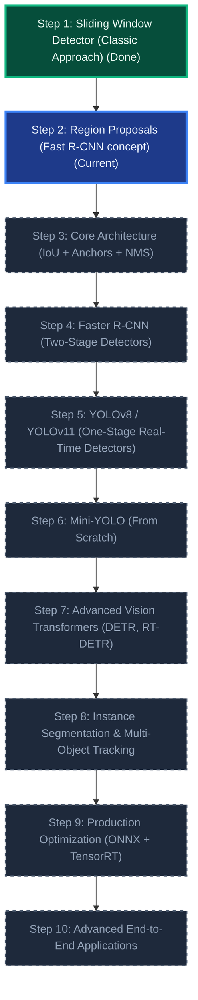

# Computer Vision & Object Detection Learning Roadmap

Welcome to the **Object Detection Learning Roadmap** repository. This project is structured as a bottom-up, hands-on journey from the most fundamental classic machine learning computer vision concepts to state-of-the-art transformer-based deep learning object detectors.

Each module in this repository is designed as a self-contained learning unit, focusing on a specific milestone in the evolution of object detection.

---

## The Learning Path



---

## Directory Index & Roadmap Progress

| Step | Module Name & Folder | Status | Key Focus Area | Preview | Live App |
|:---:|:---|:---:|:---|:---:|:---:|
| 1 | [1-Sliding-Window-Detector](./1-Sliding-Window-Detector) | **Complete** | Brute-force classification search, stride/window hyperparams, custom ResNet50 classifier model training on MNIST, batched PyTorch GPU/CPU inference, and Non-Maximum Suppression (NMS) |  | Yes (Flask + HTML5 Canvas) |
| 2 | [2-Region-Proposals(Fast_R-CNN_Idea)](./2-Region-Proposals\(Fast_R-CNN_Idea\)) | *In Progress* | Selective Search, structural bounding box proposal generation, once-per-image feature extraction, and RoI Pooling concepts |  | Planned |
| 3 | [3-IoU+Anchors+NMS(Core-Concepts)](./3-IoU+Anchors+NMS\(Core-Concepts\)) | *Planned* | Mathematical IoU implementation, anchor box shape aspect ratios, and full vector-based multi-class NMS implementation from scratch | | Planned |
| 4 | [4-Faster-R-CNN](./4-Faster-R-CNN) | *Planned* | Fully two-stage detector pipelines, Region Proposal Networks (RPN), bounding box regression loss, and torchvision fasterrcnn training | | Planned |
| 5 | [5-YOLO(Single-stage-detection)](./5-YOLO\(Single-stage-detection\)) | *Planned* | One-stage end-to-end grid prediction, objectness confidence scores, and training ultralytics models on custom datasets | | Planned |
| 6 | [6-Mini-YOLO(From-Scratch)](./6-Mini-YOLO\(From-Scratch\)) | *Planned* | Custom single-stage neural network architecture, multi-part loss function (coordinate loss + class loss + objectness loss) | | Planned |
| 7 | [7-Advanced-Detection(Transformers)](./7-Advanced-Detection\(Transformers\)) | *Planned* | Attention-based detectors, DEtection TRansformers (DETR), set prediction loss, bipartite matching, and anchor-free models | | Planned |
| 8 | [8-Tracking+Segmentation](./8-Tracking%2BSegmentation) | *Planned* | Pixel-level semantic instance masks (Mask R-CNN), Kalman filtering, DeepSORT, and multi-object linear tracking pipelines | | Planned |
| 9 | [9-Production-Systems](./9-Production-Systems) | *Planned* | Model conversions to ONNX format, TensorRT FP16/INT8 quantizations, dynamic batching, and high-performance C++/Python APIs | | Planned |
| 10 | [10-Advanced-Applications](./10-Advanced-Applications) | *Planned* | Large-scale smart multi-camera surveillance system, edge deployments, and COCO competition dataset fine-tuning | | Planned |

---

## Getting Started with Step 1: Sliding Window Detector

The first folder contains a complete, interactive visualization tool showing how a standard image classifier is adapted into an object detector.

### Quick Start:
1. Ensure you have Miniconda/Anaconda installed.
2. Open your terminal and enter the first step's folder:
   ```bash
   cd 1-Sliding-Window-Detector
   ```
3. Create the conda environment and activate it:
   ```bash
   conda create -n sliding_window_env python=3.9 -y
   ```
4. Run the automated startup script:
   ```bash
   chmod +x run.sh
   ./run.sh
   ```
5. Open your web browser and navigate to: **`http://127.0.0.1:5001`**

Read the full project detail and theory inside the [Step 1 README](./1-Sliding-Window-Detector/README.md).

---

## License
This repository is licensed under the [MIT License](LICENSE).